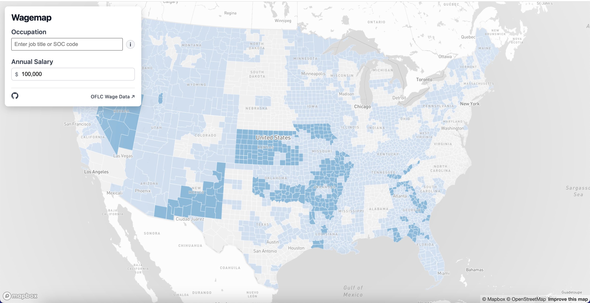

# WageMap

Interactive U.S. county-level prevailing wage explorer built with React, Vite, and Mapbox GL. Select a location, search for an occupation (SOC), enter a salary, and see which prevailing wage level applies. A lottery toggle shows estimated H-1B selection probabilities by wage level for the year 2027.



## Quick start

- Requirements: Node 18+ (or recent LTS), npm, and a Mapbox access token.
- Install dependencies:
  ```bash
  npm install
  ```
- Add your Mapbox token (required for tiles): create `.env` in the repo root with
  ```
  VITE_MAPBOX_TOKEN=pk.your-token-here
  ```
- Run the dev server: `npm run dev` (opens on http://localhost:5173 by default).
- Production build: `npm run build`; preview the static build with `npm run preview`.

## Using the map

- Pick a state (and optional county) to zoom and filter the map.
- Search for an occupation/SOC code; the autocomplete uses `public/data/soc_codes.json`.
- Enter an annual base salary to calculate the wage level; counties with data are colored by level I–IV.
- Toggle “H-1B lottery” to overlay the 2027 selection probability by wage level in the county popup.
- Share: the share button copies the current URL or invokes the native share sheet when available.

## Data

- Wage data: OFLC Prevailing Wage (2025–2026) ALC export, normalized to county-level wage floors per SOC and stored in `public/data/soc/<SOC>.json`.
- Autocomplete list: SOC codes/titles in `public/data/soc_codes.json`.
- Geography: county polygons in `public/counties.geojson`.
- Data is already bundled in the repo; no extra steps are required to run the app locally.

## Generating data

If you download newer OFLC releases, you can rebuild the JSON used by the app:

1. Install Python deps: `pip install -r scripts/requirements.txt`.
2. Place raw OFLC files (e.g., `ALC_Export.csv`, `Geography.csv`, Appendix A XLSX) under `raw/` following the existing filenames.
3. Generate county-level wages: `python scripts/process_oflc_county_wages.py` → `data/county_wages.json`.
4. Convert to per-SOC map files: adjust `INPUT` in `scripts/process_wages_for_map.py` if needed (e.g., to point at your wages JSON), then run it to populate `public/data/soc/`.
5. Refresh SOC autocomplete options from Appendix A: `python scripts/generate_soc_codes_from_appendix_a.py` (or `python scripts/extract_soc_codes.py` if you only have the wage JSON).  
   Paths at the top of each script are easy to tweak if your filenames differ.

## Deployment

`npm run build` produces a static site in `dist/` that can be hosted on any static host (Vercel, S3, etc.). Ensure `VITE_MAPBOX_TOKEN` is available in the environment at build time.

## License

MIT — see [`LICENSE`](LICENSE).
